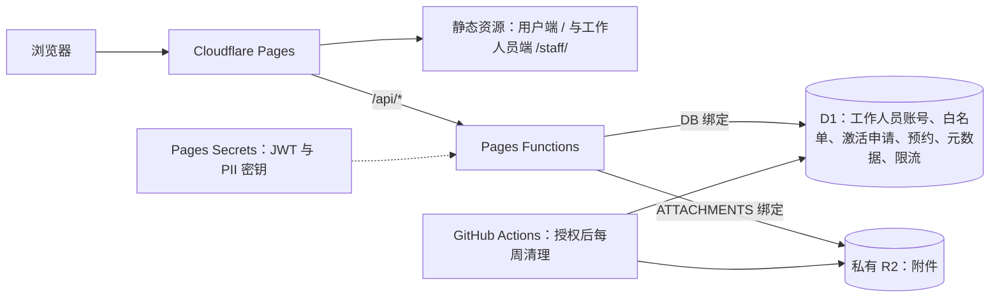

# 先锋硬件部维修预约系统

面向南湖、浑南校区的免费维修预约系统，支持预约、排队、接单、维修记录、统计和 CSV 导出。用户免注册，工作人员使用账号密码登录。

一个 Cloudflare Pages 项目托管用户端 `/`、工作人员端 `/staff/` 和同源 `/api/*`。D1 保存业务数据，私有 R2 保存附件，应用使用 JWT/RBAC 鉴权。

> `dev` 是 Preview 分支，`main` 是 Production 分支。日常修改和验收先推送到 `dev`；确认通过后再 rebase 到 `main`。向 `main` 推送或执行生产部署前，须获得明确确认。

- [业务规则与权限](docs/requirements.md)
- [工作人员白名单与自主激活](docs/staff-activation.md)
- [数据库结构](docs/data-model.md)、[学生预约凭证](docs/student-access.md)
- [Preview 验收](docs/preview-acceptance.md)：本地隔离环境和完整业务流程
- [部署与运维](docs/operations.md)：生产、Preview、域名、附件清理和备份

## Cloudflare 架构



[public/_routes.json](public/_routes.json) 仅将 `/api`、`/api/*` 交给 Functions，其余由 Pages 返回静态资源。Functions 在 Workers runtime 执行业务，通过绑定访问 D1/R2；应用自行完成 JWT 鉴权，不依赖 Cloudflare Access。浏览器不直连数据库或 R2。

| 环境 | 发布分支 | 资源与配置 |
|---|---|---|
| 生产 | `main` | `wrangler.jsonc` 顶层 D1/R2、Production Secrets |
| 预览 | `dev` | `env.preview` 独立 D1/R2、Preview Secrets |

两个环境属于同一 Pages 项目，数据、附件和密钥分别配置。GitHub Actions 负责检查，附件定时清理须在验收及维护授权后启用；R2 生命周期由操作者配置，D1 元数据与额度由清理任务同步。

## 本地运行

需要 Node.js 22+，在仓库根目录执行：

```bash
npm ci
npx playwright install chromium
npm run setup:local
npm run dev
```

打开 [用户端](http://127.0.0.1:8788/) 或 [工作人员端](http://127.0.0.1:8788/staff/)。健康检查为 `/api/health`。

`setup:local` 生成随机 `.dev.vars`、应用 D1 迁移并初始化 `root001`、`root002`；密码见该文件的 `ROOT001_PASSWORD` / `ROOT002_PASSWORD`。重复执行保留现有密钥和账号密码。

本地 D1/R2 数据由 Wrangler 保存在 `.wrangler/`。`.dev.vars`、`.wrangler/`、`dist/` 不提交。修改前端后重新执行 `npm run build` 或重启 `npm run dev`；Functions 由 Wrangler 监听。

## 开发导航

| 位置 | 职责 |
|---|---|
| [frontend/](frontend/)、[shared/](shared/) | 两个独立前端、公共 UI、API、状态和上海时间工具 |
| [functions/api/](functions/api/)、[src/app.js](src/app.js) | API 入口、同源检查和错误响应 |
| [src/context.js](src/context.js) | 每请求创建 D1 session，注入仓库和服务 |
| [src/routes/](src/routes/) → [src/services/](src/services/) → [src/db/](src/db/) | HTTP 适配 → 业务与权限 → D1 SQL |
| [src/lib/](src/lib/) | JWT、scrypt、联系方式加密、校验工具 |
| [migrations/](migrations/)、[wrangler.jsonc](wrangler.jsonc) | 数据库结构、Pages 配置与 D1/R2 绑定 |
| [scripts/](scripts/)、[tests/](tests/) | 构建、部署、运维和自动化检查 |

构建仅向 `dist/` 复制前端和 [public/](public/) 静态资源，Functions 单独随 Pages 发布。SQL 查询、统计和并发约束由 D1 执行；运行时不迁移数据库或初始化账号。当前为破坏性重建版本，只提供全新初始迁移；旧测试数据库须显式重建。正式上线后的变更再追加迁移。

## 常用检查

```bash
npm run verify             # CI：lint、架构审计、编译、测试、迁移验证
npm test                   # 隔离的 workerd + D1 + R2 集成测试及前端结构测试
npm run test:e2e           # 新建临时 D1/R2，运行 Chromium 业务与手机端测试后清理
npm run preview:local      # 同一隔离环境，供手动验收；停止后清理临时数据
npm run release:plan       # 仅打印生产发布计划；加 -- --preview 查看 Preview
npm run smoke              # 先启动 npm run dev，再检查页面与 API
npm run smoke -- https://repair.example.edu
```

其他命令见 [package.json](package.json)。`verify` 包含实际 Chromium 浏览器验收，覆盖预约、私人链接、附件补传、账号激活、接单、权限变更、凭证补发、密码修改、会话撤销和手机端交互。浏览器测试使用随机密钥及全新本地资源，截图和失败追踪位于忽略的 `output/playwright/`；云端 Preview 和线上域名仍需单独验收。

远程迁移、root 初始化和部署命令默认只打印本地计划。实际执行需要明确的人为授权、匹配环境的执行参数和干净的审查提交，具体步骤及[发布记录](docs/release-record.md)见[重建发布流程](docs/operations.md)。发布不隐式执行迁移。

## API 速查

工作人员请求使用 `Authorization: Bearer <JWT>`；访客凭浏览器自动保存的随机访问凭证查询、取消或访问附件，详见 [学生访问机制](docs/student-access.md)。用户端请求不携带工作人员 JWT。

| 方法 | 路径 | 用途 |
|---|---|---|
| GET | `/api/health` | 检查 D1 和 R2 |
| POST | `/api/auth/login`、`/api/auth/logout` | 登录、撤销会话 |
| GET | `/api/auth/me` | 当前账号 |
| PATCH / POST | `/api/auth/password` / `/api/auth/revoke` | 本人改密 / 撤销全部会话 |
| POST / GET | `/api/activation` / `/api/activation/:id` | 提交激活 / 凭私人回执查审核状态 |
| GET / POST | `/api/appointments` | 登录账号列表查询 / 访客创建 |
| GET | `/api/appointments/:id` | 学生凭访问凭证查询 |
| POST | `/api/appointments/:id/credential` | 管理员人工核验后重签学生凭证 |
| PATCH | `/api/appointments/:id/status` | 状态、接单、维修记录或访客取消 |
| GET / POST | `/api/appointments/:id/attachments` | 附件列表 / 上传 |
| GET | `/api/appointments/:id/attachments/:attachmentId` | 附件下载 |
| GET | `/api/live/summary` | 名额和个人排队位置 |
| GET | `/api/stats/summary`、`/api/stats/fault-types` | admin+ 统计 |
| GET | `/api/users` | admin+ 账号列表 |
| PATCH | `/api/users/:account` | 管理低于自身且非保护账号 |
| GET / POST | `/api/staff-whitelist` / `/api/staff-whitelist/import` | 名册列表 / CSV 批量导入 |
| PATCH | `/api/staff-whitelist/:studentId` | 撤销或恢复激活资格 |
| GET / POST | `/api/activation-requests` / `/api/activation-requests/review` | 申请列表 / 核验后批量审批或拒绝 |
| GET | `/api/export/appointments.csv` | admin+ 导出 |

预约列表支持 `q/campus/date/status` 筛选；统计支持 `range=7/30/all` 和可选 `day`。个人排队查询使用 `appointmentId` 和 `X-Appointment-Token` 请求头；公开名额查询支持 `date/campus/timeSlot`。

附件上传 JSON 为 `{filename, mimeType, data}`，`data` 是标准 base64。访客的查询、取消、排队及附件 API 均须提供 `X-Appointment-Token`；工作人员凭 JWT 访问。私人查询链接将凭证放在 URL fragment，浏览器只保存编号和凭证。
