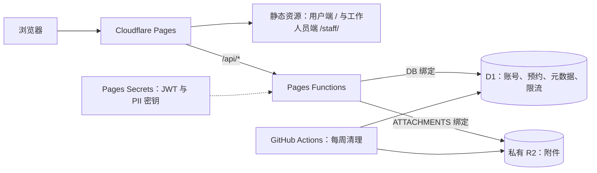

# 先锋硬件部维修预约系统

面向南湖、浑南校区的免费维修预约系统，支持预约、排队、接单、维修记录、统计和 CSV 导出。用户免注册，工作人员使用账号密码登录。

一个 Cloudflare Pages 项目托管用户端 `/`、工作人员端 `/staff/` 和同源 `/api/*`。D1 保存业务数据，私有 R2 保存附件，应用使用 JWT/RBAC 鉴权。

> `main` 是生产分支。日常修改在开发分支完成；向 `main` 推送或执行生产部署前，须获得明确确认。

- [业务规则与权限](docs/requirements.md)
- [部署与运维](docs/operations.md)：生产、Preview、域名、附件清理和备份

## Cloudflare 架构



[public/_routes.json](public/_routes.json) 仅将 `/api`、`/api/*` 交给 Functions，其余由 Pages 返回静态资源。Functions 在 Workers runtime 执行业务，通过绑定访问 D1/R2；应用自行完成 JWT 鉴权，不依赖 Cloudflare Access。浏览器不直连数据库或 R2。

| 环境 | 发布分支 | 资源与配置 |
|---|---|---|
| 生产 | `main` | `wrangler.jsonc` 顶层 D1/R2、Production Secrets |
| 预览 | `preview`（仓库部署脚本） | `env.preview` 独立 D1/R2、Preview Secrets |

两个环境属于同一 Pages 项目，数据、附件和密钥分别配置。GitHub Actions 负责检查和附件定时清理；R2 生命周期独立删除过期对象，D1 元数据与额度由清理任务同步。

## 本地运行

需要 Node.js 22+，在仓库根目录执行：

```bash
npm ci
npm run setup:local
npm run dev
```

打开 [用户端](http://127.0.0.1:8788/) 或 [工作人员端](http://127.0.0.1:8788/staff/)。健康检查为 `/api/health`。

`setup:local` 生成随机 `.dev.vars`、应用 D1 迁移并初始化 `root001`、`root002`；密码见该文件的 `ROOT001_PASSWORD` / `ROOT002_PASSWORD`。重复执行保留现有密钥和账号密码。

本地 D1/R2 数据由 Wrangler 保存在 `.wrangler/`。`.dev.vars`、`.wrangler/`、`dist/` 不提交。修改前端后重新执行 `npm run build` 或重启 `npm run dev`；Functions 由 Wrangler 监听。

## 开发导航

| 位置 | 职责 |
|---|---|
| [frontend/](frontend/)、[shared/](shared/) | 两个独立前端、公共 UI、API、状态和上海时间工具 |
| [functions/api/](functions/api/)、[src/app.js](src/app.js) | API 入口、同源检查和错误响应 |
| [src/context.js](src/context.js) | 每请求创建 D1 session，注入仓库和服务 |
| [src/routes/](src/routes/) → [src/services/](src/services/) → [src/db/](src/db/) | HTTP 适配 → 业务与权限 → D1 SQL |
| [src/lib/](src/lib/) | JWT、scrypt、联系方式加密、校验工具 |
| [migrations/](migrations/)、[wrangler.jsonc](wrangler.jsonc) | 数据库结构、Pages 配置与 D1/R2 绑定 |
| [scripts/](scripts/)、[tests/](tests/) | 构建、部署、运维和自动化检查 |

构建仅向 `dist/` 复制前端和 [public/](public/) 静态资源，Functions 单独随 Pages 发布。SQL 查询、统计和并发约束由 D1 执行；运行时不迁移数据库或初始化账号。已应用的迁移不得修改，结构调整追加编号 SQL。

## 常用检查

```bash
npm run verify             # CI：lint、架构审计、编译、测试、迁移验证
npm test                   # 隔离的 workerd + D1 + R2 集成测试及前端结构测试
npm run smoke              # 先启动 npm run dev，再检查页面与 API
npm run smoke -- https://repair.example.edu
```

其他命令见 [package.json](package.json)。自动化测试覆盖权限、会话、预约并发、附件容量与清理等，不包含实际浏览器操作；线上资源和业务流程需另行验收。

## API 速查

工作人员请求使用 `Authorization: Bearer <JWT>`；访客以预约编号和学号查询、取消或访问附件。用户端请求不携带工作人员 JWT。

| 方法 | 路径 | 用途 |
|---|---|---|
| GET | `/api/health` | 检查 D1 和 R2 |
| POST | `/api/auth/login`、`/api/auth/logout` | 登录、撤销会话 |
| GET | `/api/auth/me` | 当前账号 |
| GET / POST | `/api/appointments` | 登录账号列表查询 / 访客创建 |
| GET | `/api/appointments/lookup?appointmentId=...&studentId=...` | 访客查询 |
| PATCH | `/api/appointments/:id/status` | 状态、接单、维修记录或访客取消 |
| GET / POST | `/api/appointments/:id/attachments` | 附件列表 / 上传 |
| GET | `/api/appointments/:id/attachments/:attachmentId` | 附件下载 |
| GET | `/api/live/summary` | 名额和个人排队位置 |
| GET | `/api/stats/summary`、`/api/stats/fault-types` | admin+ 统计 |
| GET / POST | `/api/users` | admin+ 账号列表 / 新建基础账号 |
| PATCH / DELETE | `/api/users/:account` | 管理低于自身且非保护账号 |
| GET | `/api/export/appointments.csv` | admin+ 导出 |

预约列表支持 `q/campus/date/status` 筛选；统计支持 `range=7/30/all` 和可选 `day`。个人排队查询使用 `appointmentId`、`studentId`；公开名额查询支持 `date/campus/timeSlot`。

附件上传 JSON 为 `{studentId, filename, mimeType, data}`，`data` 是标准 base64；工作人员凭 JWT 可省略 `studentId`。访客附件 GET 使用 `?studentId=...`，取消预约提交 `{status: 'cancelled', studentId}`。附件元数据含 UTC ISO 格式的 `createdAt`、`expiresAt`；过期下载返回 404，容量不足返回 507。其他输入和错误处理见 [校验规则](src/lib/validation.js)、[附件校验](src/lib/attachment-input.js) 及 [路由](src/routes/)。
