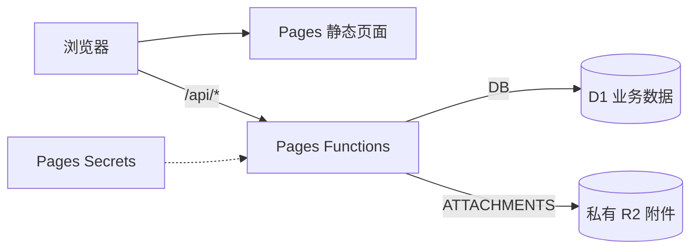

# 先锋硬件部维修预约系统

面向南湖、浑南校区的免费维修预约系统：学生免注册预约、查询和展示二维码；工作人员扫码、拍照签到、记录维修结果；管理员管理预约、账号、容量、统计与导出。

## 架构

一个 Cloudflare Pages 项目提供用户端 `/`、工作人员端 `/staff/` 和同源 `/api/*`。前端使用原生 HTML/CSS/JavaScript，Pages Functions 负责业务与 JWT/RBAC 鉴权。


```mermaid
flowchart LR
  Browser[浏览器] --> Pages[Pages 静态页面]
  Browser -->|/api/*| Functions[Pages Functions]
  Functions -->|DB| D1[(D1 业务数据)]
  Functions -->|ATTACHMENTS| R2[(私有 R2 附件)]
  Secrets[Pages Secrets] -.-> Functions
```

附件经鉴权 API 访问。`main` 发布 Production；`dev` 和普通功能分支发布共享测试 D1/R2 的 Preview；`next/staff-platform` 发布独立 Staff Staging；`feat/staff-*` 仅运行隔离验证。推送会触发对应发布，不要未经授权推送 `main`。迁移与发布规则见 [部署运维](docs/operations.md)。

## 本地开发

需要 Node.js 22+：

```bash
npm ci
npx playwright install chromium
npm run setup:local
npm run dev
```

访问 [用户端](http://127.0.0.1:8788/) 或 [工作人员端](http://127.0.0.1:8788/staff/)。`setup:local` 生成随机 `.dev.vars`、应用迁移并初始化 `root001`、`root002`，密码在该文件中；已有配置和密码不覆盖。本地数据位于 `.wrangler/`，不连接远程资源。

| 命令 | 用途 |
|---|---|
| `npm run verify` | 代码、架构、单元/集成、迁移与 Chromium E2E 检查 |
| `npm run preview:local` | 隔离的本地测试预览 |
| `npm run preview:booking-layout` | 预约布局预览（8790 端口，模拟数据、禁用提交） |
| `npm run test:booking-layout` | 预约布局回归 |

源码：`frontend/` 为页面，`shared/` 为公共模块；API 按 `functions/api/` → `src/routes/` → `src/services/` → `src/db/` 分层。工作台壳层、维修流程和卡片渲染分别位于 `workbench.js`、`scan.js`、`scan-details.js`；未来状态组件可挂载到 `#workbench-status`。

## 文档

- [业务规则与权限](docs/requirements.md)
- [数据库结构与约束](docs/data-model.md)
- [部署、迁移、回退与维护](docs/operations.md)
- [长期集成分支与 Staff Staging](docs/staff-staging.md)
